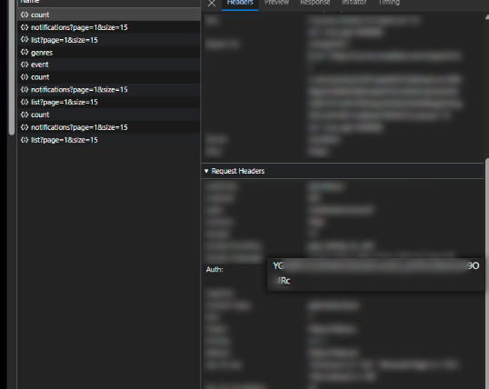

# anitube2hikka
The script move your bookmarks from [Anitube.in.ua](https://anitube.in.ua) app to [hikka.io](https://hikka.io) site

## Installation

You can install requests lib using git and terminal:

```bash
git clone https://github.com/MrIkso/anitube2hikka
cd anitube2hikka
pip install -r requirements.txt
```

## Authorisation
How to get auth code to use methods associated with your profile
1. Copy the value of the `Auth` header from F12 menu.


## Usage

Run script via terminal

```bash
anitube2hikka.py --username your_anitube_username --token your_token
```

## Documentation

The official documentation can be found at [api.hikka.io](https://api.hikka.io/docs#)

## Contributing

If you'd like to contribute to this project, please fork the repository and create a pull request. You can also open an issue if you find any bugs or have any feature requests.
